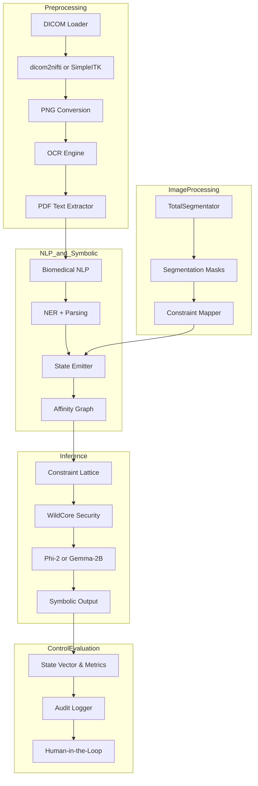

## Remote OHIF Access

The :mod:`msk_io.retrieval` package provides helpers for working with
web-based viewers. ``OHIFCanvasExtractor`` captures rendered frames using
a headless browser. ``DICOMStreamSniffer`` monitors network traffic to
download the original DICOM payloads. ``RemoteDICOMLoader`` combines both
methods and is triggered when ``remote_url`` and ``auth_token`` are set in
``PipelineSettings``.
